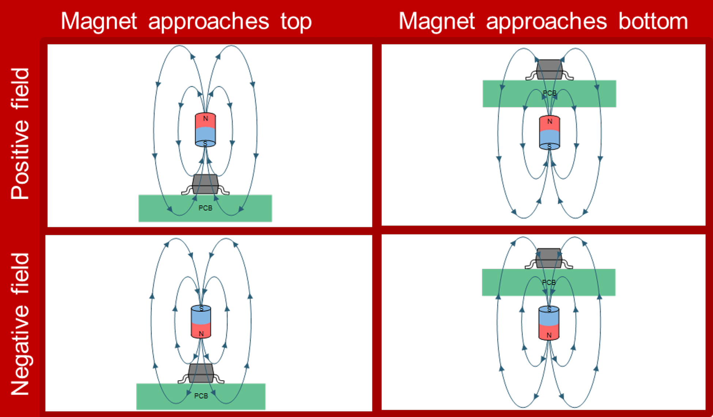

# Hall Sensor Compatibility

**NOTE**: As far as I'm aware, the KS-20 and Lekker switches use the same mechanism, and the only differences are branding, colours and spring weight. It should be possible to use them interchangably.

In the KS-20's datasheet, there are a few key pieces of information:

- Total Travel: 4.1 +/- 0.2mm
- Hall Sensor Placement: Back of PCB
- Orientation of Permanent Magnet: North pole at bottom of switch
- Magnetic Flux Density @ North Pole:
  - Initial Position: 102 +/- 15G
  - Total Travel Position: 905 +/- 80G

Based on the hall sensor placement and the orientation of the permanent magnet, it generates a positive field. In the diagram below (credit: [Texas Instruments - SLYT826](https://www.ti.com/document-viewer/lit/html/slyt826)), we can see this in the top-right case:

This means that the hall sensor used needs to have the following properties:

- Detect a positive magnetic field (sometimes referred to as "south active")
- Produce a linear output so we can get analog readings
- Have a magnetic range that covers the maximum magnetic flux
- (Ideally) Unipolar i.e. reacts to only one pole / field direction
  - Technically, we can use a bipolar sensor that reacts to both poles, but we lose half of the resolution to a range of values that we won't use

The DRV5056A4 was chosen as it meets most of this criteria:

- Has a variant that can detect positive fields
- Generates a linear output
- Has a magnetic range of 155mT (1550G) at 3.3V
- Is unipolar

I had originally chosen the DRV5056A3, which is the same as the A4 aside from the magnetic range (78mT at 3.3V). While it would be compatible, [the calculations](./notebooks/magnet-distance.ipynb) showed that we'd lose the last 0.2mm of travel on average.
