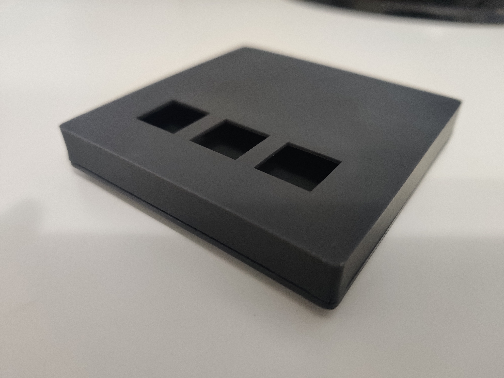
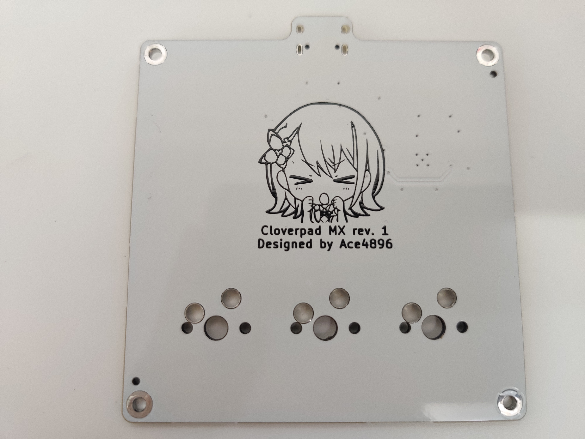

# Cloverpad rev. 1

**NOTE**: I don't recommend using these designs; see the list [known issues](#known-issues) below.

This folder contains the hardware designs for the Cloverpad rev. 1.

[Photo Gallery](./img)

Features:

- RP2040 MCU
- Cloverpad MX PCB - supports hot-swappable MX-style digital switches
- 3D printed case w/ threaded inserts

Required parts (for reference):

- 3D printed case + PCB
- USB Type-C cable
- 8x M2x6mm screws
- 8x M2x3mm threaded inserts
- Rubber feet

## Design Files

- [`cloverpad-case.FCStd`](./cloverpad-case.FCStd): FreeCAD 0.21 project for the 3D printed case.
  - [`cloverpad-case-top.step`](./cloverpad-case-top.step) and [`cloverpad-case-bottom.step`](./cloverpad-case-bottom.step) are exported from this FreeCAD project
- [`cloverpad-mx-pcb`](./cloverpad-mx-pcb): KiCad 8 project for the Cloverpad MX rev. 1 PCB.

## Known Issues

There are a few major flaws with this design

- When installing threaded inserts into the top/bottom pieces, the walls surrounding the threaded insert can crack
  - This is due to the supporting walls being too thin and/or the blind hole being too shallow
- On the Cloverpad MX PCB, it's impossible to solder switches directly to the PCB while the PCB is screwed in
  - This is an oversight that I completely missed; as a result, it only works in a hotswap configuration
  - Note that Mill-Max sockets are not compatible, as the holes for the switch pins are wider to accommodate for Kailh hotswap sockets
- There is a chance that the manufactured PCB won't boot into the flashed firmware, and infinitely boots into bootloader mode
  - Not sure what could cause this - faulty flash chip, bad reset / boot select circuit design, manufacturing error or user error

Rev. 2 will address these by:

- Increasing the supporting wall thickness to 3+ mm
  - To keep the case size small, the PCB screws need to be moved inwards slightly
- Moving all threaded inserts to the top pieces
  - This will allow direct soldering instead of hotswap for the Cloverpad MX
- Adjusting the routing around the boot select circuit and flash chip

## Other Potential Improvements

- **6-degree Typing Angle**
  - Having a slight incline (similar to a regular keyboard) would make this easier to use
- **Hiding Switch Tops**
  - An additional piece could be added above the switch plate, to hide the tops of the switches
  - This would also have the threaded inserts
- **Filling Empty Space**
  - Rev. 1's case has lots of empty space above and below the PCB
  - The top switch plate can be adjusted to only have 1.5mm thickness around the switch cutouts, and ~3.5mm elsewhere
